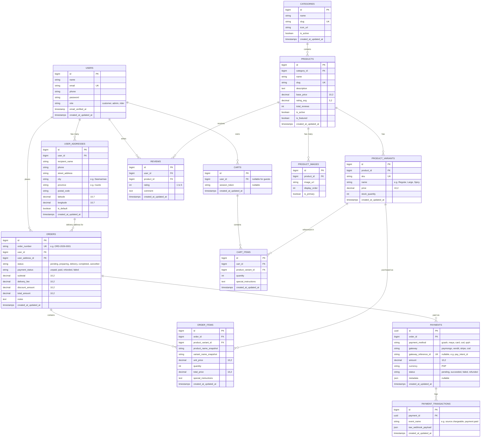

# Database Entity-Relationship Diagram (ERD)

Here is the structured architecture of the Laravel backend database we generated:

```mermaid
erDiagram
    USERS ||--o{ USER_ADDRESSES : "has many"
    USERS ||--o{ ORDERS : "places"
    USERS ||--o{ CARTS : "owns"
    USERS ||--o{ REVIEWS : "writes"

    CATEGORIES ||--o{ PRODUCTS : "contains"
    PRODUCTS ||--o{ PRODUCT_VARIANTS : "has"
    PRODUCTS ||--o{ PRODUCT_IMAGES : "has many"
    PRODUCTS ||--o{ REVIEWS : "receives"

    CARTS ||--o{ CART_ITEMS : "contains"
    PRODUCT_VARIANTS ||--o{ CART_ITEMS : "referenced in"

    ORDERS ||--o{ ORDER_ITEMS : "contains"
    PRODUCT_VARIANTS ||--o{ ORDER_ITEMS : "purchased as"
    USER_ADDRESSES ||--o{ ORDERS : "delivery address for"

    ORDERS ||--o{ PAYMENTS : "paid via"
    PAYMENTS ||--o{ PAYMENT_TRANSACTIONS : "logs"

    USERS {
        bigint id PK
        string name
        string email UK
        string phone
        string password
        string role "customer, admin, rider"
        timestamp email_verified_at
        timestamps created_at_updated_at
    }

    USER_ADDRESSES {
        bigint id PK
        bigint user_id FK
        string recipient_name
        string phone
        string street_address
        string city "e.g. Dasmarinas"
        string province "e.g. Cavite"
        string postal_code
        decimal latitude "10,7"
        decimal longitude "10,7"
        boolean is_default
        timestamps created_at_updated_at
    }

    CATEGORIES {
        bigint id PK
        string name
        string slug UK
        string icon_url
        boolean is_active
        timestamps created_at_updated_at
    }

    PRODUCTS {
        bigint id PK
        bigint category_id FK
        string name
        string slug UK
        text description
        decimal base_price "10,2"
        decimal rating_avg "3,2"
        int total_reviews
        boolean is_active
        boolean is_featured
        timestamps created_at_updated_at
    }

    PRODUCT_IMAGES {
        bigint id PK
        bigint product_id FK
        string image_url
        int display_order
        boolean is_primary
    }

    PRODUCT_VARIANTS {
        bigint id PK
        bigint product_id FK
        string sku UK
        string name "e.g. Regular, Large, Spicy"
        decimal price "10,2"
        int stock_quantity
        timestamps created_at_updated_at
    }

    CARTS {
        bigint id PK
        bigint user_id FK "nullable for guests"
        string session_token "nullable"
        timestamps created_at_updated_at
    }

    CART_ITEMS {
        bigint id PK
        bigint cart_id FK
        bigint product_variant_id FK
        int quantity
        text special_instructions
        timestamps created_at_updated_at
    }

    ORDERS {
        bigint id PK
        string order_number UK "e.g. ORD-2026-0001"
        bigint user_id FK
        bigint user_address_id FK
        string status "pending, preparing, delivery, completed, cancelled"
        string payment_status "unpaid, paid, refunded, failed"
        decimal subtotal "10,2"
        decimal delivery_fee "10,2"
        decimal discount_amount "10,2"
        decimal total_amount "10,2"
        text notes
        timestamps created_at_updated_at
    }

    ORDER_ITEMS {
        bigint id PK
        bigint order_id FK
        bigint product_variant_id FK
        string product_name_snapshot
        string variant_name_snapshot
        decimal unit_price "10,2"
        int quantity
        decimal total_price "10,2"
        text special_instructions
        timestamps created_at_updated_at
    }

    PAYMENTS {
        uuid id PK
        bigint order_id FK
        string payment_method "gcash, maya, card, cod, qrph"
        string gateway "paymongo, xendit, stripe, cod"
        string gateway_reference_id UK "nullable, e.g. pay_intent_id"
        decimal amount "10,2"
        string currency "PHP"
        string status "pending, succeeded, failed, refunded"
        json metadata "nullable"
        timestamps created_at_updated_at
    }

    PAYMENT_TRANSACTIONS {
        bigint id PK
        uuid payment_id FK
        string event_name "e.g. source.chargeable, payment.paid"
        json raw_webhook_payload
        timestamps created_at_updated_at
    }

    REVIEWS {
        bigint id PK
        bigint user_id FK
        bigint product_id FK
        int rating "1 to 5"
        text comment
        timestamps created_at_updated_at
    }
```
