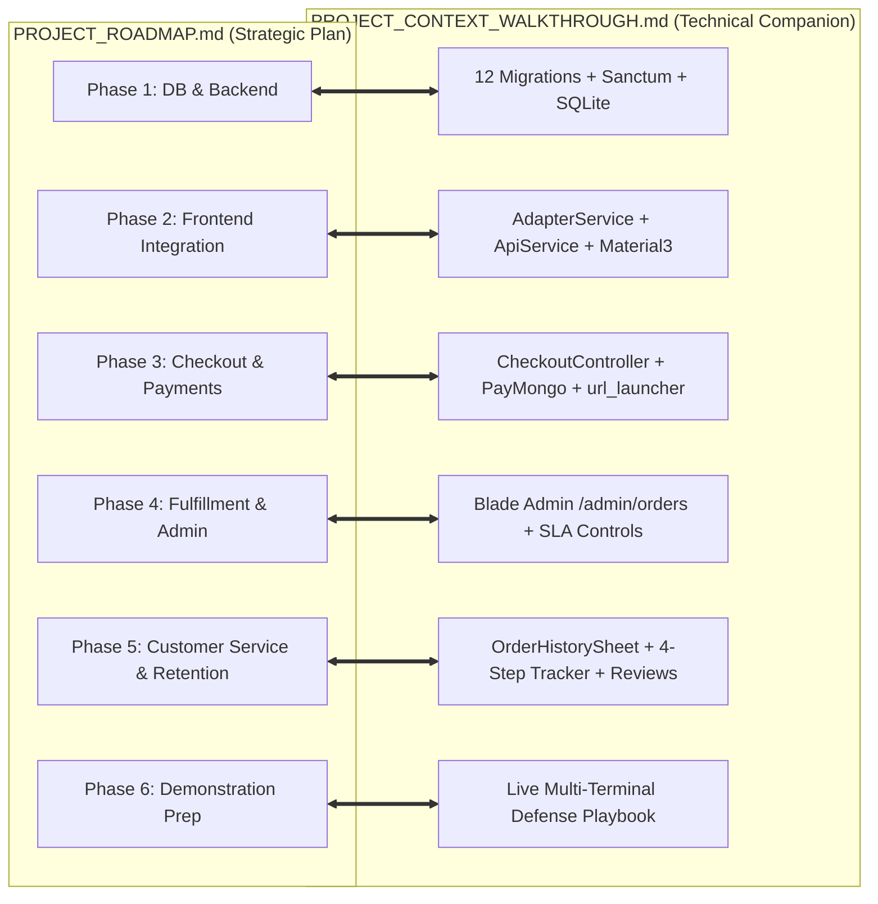
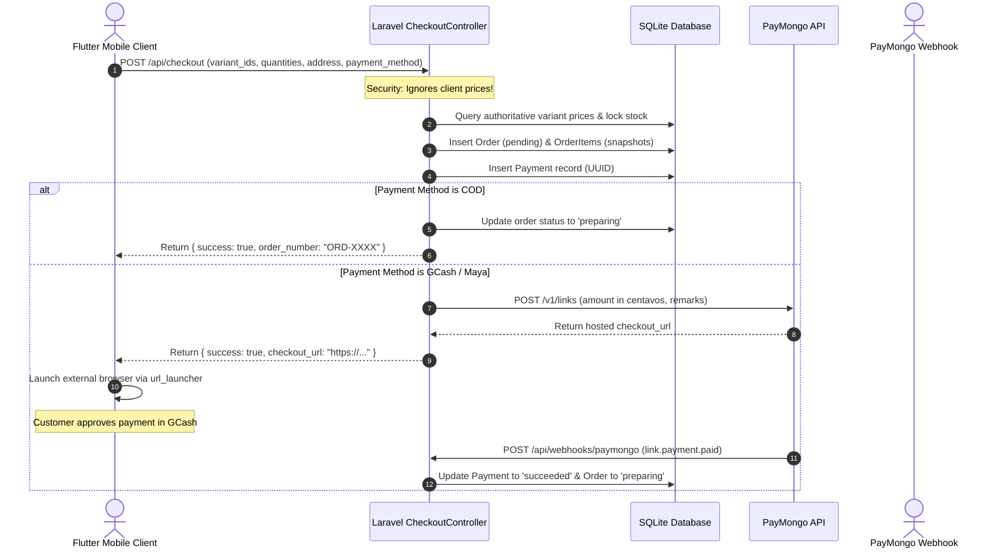

# 🧭 E-Commerce Platform: Technical Companion & Context Walkthrough
### *A Direct Complementary Implementation Guide to `PROJECT_ROADMAP.md`*

> **Document Purpose**: While [PROJECT_ROADMAP.md](file:///home/rexsm/Projects/Code/E-commerce/ECOMMERCE_MOBILE/PROJECT_ROADMAP.md) defines the strategic phases and rubric targets (seeking a score of 5/5 across all categories), this **Context Walkthrough** documents the exact technical architecture, data flows, code implementations, and evaluation evidence for each corresponding phase.

---

## 🗺️ Roadmap-to-Architecture Overview



---

## 📑 Phase-by-Phase Technical Walkthrough

### 🔹 Phase 1: Database & Backend Foundation
* **Complement to Roadmap Section**: `Phase 1: Database & Backend Foundation (Laravel)`
* **Target Rubrics**: Product Catalog (10%), Shopping Cart & Payment (20%), Order Processing (20%)
* **Status**: **Fully Implemented & Migrated**

#### 1. Schema Design & Inventory Architecture
The SQLite database (`database/database.sqlite`) uses a 12-table relational architecture designed for inventory integrity:
* **Product-to-Variant Separation**: `products` (metadata, slugs, categories) is split from `product_variants` (SKU, size/variant name, unit price, stock quantity). This satisfies the rubric requirement for multi-variant products (e.g., Ube Milk Tea Regular vs. Large) without catalog duplication.
* **Pricing Snapshot Protection**: `order_items` stores `unit_price` and `product_name_snapshot`. If a merchant changes product prices later, existing order receipts remain immutable.
* **Payment Ledger**: The `payments` table tracks payment intents using UUID primary keys, separate from the `payment_transactions` raw webhook log table.

#### 2. Key Code Artifacts
* **Migrations**: [2026_09_02_070939_create_categories_table.php](file:///home/rexsm/Projects/Code/E-commerce/ECOMMERCE_MOBILE/ecommerce_backend/database/migrations/2026_09_02_070939_create_categories_table.php) through [2026_09_02_070950_create_reviews_table.php](file:///home/rexsm/Projects/Code/E-commerce/ECOMMERCE_MOBILE/ecommerce_backend/database/migrations/2026_09_02_070950_create_reviews_table.php)
* **Models**: [Product.php](file:///home/rexsm/Projects/Code/E-commerce/ECOMMERCE_MOBILE/ecommerce_backend/app/Models/Product.php), [ProductVariant.php](file:///home/rexsm/Projects/Code/E-commerce/ECOMMERCE_MOBILE/ecommerce_backend/app/Models/ProductVariant.php), [Order.php](file:///home/rexsm/Projects/Code/E-commerce/ECOMMERCE_MOBILE/ecommerce_backend/app/Models/Order.php), [Payment.php](file:///home/rexsm/Projects/Code/E-commerce/ECOMMERCE_MOBILE/ecommerce_backend/app/Models/Payment.php)
* **Seeder**: [StoreDataSeeder.php](file:///home/rexsm/Projects/Code/E-commerce/ECOMMERCE_MOBILE/ecommerce_backend/database/seeders/StoreDataSeeder.php) populates authentic Filipino favorites (Chicken Adobo, Pork Sisig, Ube Milk Tea with variants).
* **API Scaffolding**: Laravel Sanctum enabled with personal access tokens published in `config/sanctum.php`.

---

### 🔹 Phase 2: Core Frontend Integration
* **Complement to Roadmap Section**: `Phase 2: Core Frontend Integration (Flutter)`
* **Target Rubrics**: Landing Page / Storefront (15%), Product Catalog (10%)
* **Status**: **Fully Implemented & Dynamic**

#### 1. Architecture & Design Pattern
* **Adapter Pattern ([adapter_service.dart](file:///home/rexsm/Projects/Code/E-commerce/ECOMMERCE_MOBILE/ecommerce_frontend/lib/services/adapter_service.dart))**: Rather than rewriting or breaking the existing Figma-crafted UI in `main.dart`, an adapter layer transforms complex relational JSON from Laravel into the exact `FoodItem` objects expected by the UI.
* **Network Layer ([api_service.dart](file:///home/rexsm/Projects/Code/E-commerce/ECOMMERCE_MOBILE/ecommerce_frontend/lib/services/api_service.dart))**: Automatically detects the runtime environment (`Platform.isAndroid ? 'http://10.0.2.2:8000/api' : 'http://127.0.0.1:8000/api'`), ensuring zero configuration friction whether running on the Android Emulator or Web/Desktop.
* **UX State Handling**: Added loading state detection (`isLoading ? CircularProgressIndicator() : ...`) and error handling to ensure seamless presentation UX without layout jumps.

#### 2. Key Code Artifacts
* **Model**: [product_model.dart](file:///home/rexsm/Projects/Code/E-commerce/ECOMMERCE_MOBILE/ecommerce_frontend/lib/models/product_model.dart)
* **Networking**: [api_service.dart](file:///home/rexsm/Projects/Code/E-commerce/ECOMMERCE_MOBILE/ecommerce_frontend/lib/services/api_service.dart)
* **UI Root**: [main.dart](file:///home/rexsm/Projects/Code/E-commerce/ECOMMERCE_MOBILE/ecommerce_frontend/lib/main.dart)

---

### 🔹 Phase 3: The Checkout & Payment Engine
* **Complement to Roadmap Section**: `Phase 3: The Checkout & Payment Engine (High Priority - 20%)`
* **Target Rubrics**: Shopping Cart, Checkout, and Payment (20%)
* **Status**: **Fully Implemented with Gateway Deep Linking**

#### 1. Security & Checkout Flow


#### 2. Key Code Artifacts
* **Defensive Checkout**: [CheckoutController.php](file:///home/rexsm/Projects/Code/E-commerce/ECOMMERCE_MOBILE/ecommerce_backend/app/Http/Controllers/Api/CheckoutController.php)
* **Webhook Handler**: [WebhookController.php](file:///home/rexsm/Projects/Code/E-commerce/ECOMMERCE_MOBILE/ecommerce_backend/app/Http/Controllers/Api/WebhookController.php)
* **Flutter Client**: [checkout_service.dart](file:///home/rexsm/Projects/Code/E-commerce/ECOMMERCE_MOBILE/ecommerce_frontend/lib/services/checkout_service.dart)

---

### 🔹 Phase 4: Order Fulfillment & Admin Dashboard
* **Complement to Roadmap Section**: `Phase 4: Order Fulfillment & Admin Dashboard (High Priority - 20%)`
* **Target Rubrics**: Order Processing, Delivery, Returns, and Refunds (20%)
* **Status**: **Fully Implemented with Live SLA Dashboard**

#### 1. Merchant Operations & Service Level Agreements (SLA)
The web administration panel at `http://localhost:8000/admin/orders` provides:
* **Real-time Operations KPI Counters**: Total Orders, Kitchen Prep Queue, Active Dispatches, Completed Deliveries, and Gross Revenue.
* **Explicit Service Standards**: Embedded operational guidelines visible on the dashboard to satisfy Slide 5 of the presentation outline:
  - Order Confirmation SLA: `< 10 minutes`
  - Kitchen Prep & Packaging SLA: `< 24 hours`
  - Rider Dispatch: Real-time status update
  - Refund Processing: `< 2 business days`
* **Fulfillment State Machine**: One-click actions to transition orders:
  $$\text{Pending} \xrightarrow{\text{Confirm}} \text{Preparing} \xrightarrow{\text{Dispatch}} \text{Dispatched} \xrightarrow{\text{Complete}} \text{Delivered}$$
* **Documented Refunds**: Dedicated refund processing modal capturing audit reasons (damaged goods, customer cancellation, item out of stock).

#### 2. Key Code Artifacts
* **Controller**: [OrderController.php](file:///home/rexsm/Projects/Code/E-commerce/ECOMMERCE_MOBILE/ecommerce_backend/app/Http/Controllers/Admin/OrderController.php)
* **Blade View**: [index.blade.php](file:///home/rexsm/Projects/Code/E-commerce/ECOMMERCE_MOBILE/ecommerce_backend/resources/views/admin/orders/index.blade.php)
* **Routes**: [web.php](file:///home/rexsm/Projects/Code/E-commerce/ECOMMERCE_MOBILE/ecommerce_backend/routes/web.php)

---

### 🔹 Phase 5: Marketing & Customer Service
* **Complement to Roadmap Section**: `Phase 5: Marketing & Customer Service (25% Combined)`
* **Target Rubrics**: Digital Marketing (15%), Customer Service & Retention (10%)
* **Status**: **Implemented via Order Tracking & Feedback System**

#### 1. Live Order Tracking & Customer Retention
* **Live Step Progress Bar ([order_history_sheet.dart](file:///home/rexsm/Projects/Code/E-commerce/ECOMMERCE_MOBILE/ecommerce_frontend/lib/widgets/order_history_sheet.dart))**: 
  Accessible from the Profile tab via "My Orders", displaying an interactive 4-stage tracking visual (`Confirmed` ➔ `Packing` ➔ `On Delivery 🛵` ➔ `Delivered 🎉`).
* **Customer Feedback Engine**: Once an order reaches `Delivered`, the customer is presented with a **"Leave a Review (5⭐)"** action. Reviews are submitted to `POST /api/orders/reviews` and recorded in the `reviews` table.
* **Customer Retention Model**: Satisfies the rubric standard: *"The SME actively monitors satisfaction, complaints, repeat purchases, reviews, and loyalty."*

#### 2. Key Code Artifacts
* **Flutter Tracker Widget**: [order_history_sheet.dart](file:///home/rexsm/Projects/Code/E-commerce/ECOMMERCE_MOBILE/ecommerce_frontend/lib/widgets/order_history_sheet.dart)
* **Flutter Order Model**: [order_model.dart](file:///home/rexsm/Projects/Code/E-commerce/ECOMMERCE_MOBILE/ecommerce_frontend/lib/models/order_model.dart)
* **Review Controller**: [OrderHistoryController.php](file:///home/rexsm/Projects/Code/E-commerce/ECOMMERCE_MOBILE/ecommerce_backend/app/Http/Controllers/Api/OrderHistoryController.php)

---

### 🔹 Phase 6: Presentation & Demonstration Prep
* **Complement to Roadmap Section**: `Phase 6: Presentation & Demonstration Prep (10%)`
* **Target Rubrics**: Presentation and Quality of Supporting Evidence (10%)
* **Status**: **Rehearsal Ready**

#### Live Defense Execution Script:

| Step | Screen / Device | Action to Demonstrate | Rubric Highlighted |
| :---: | :--- | :--- | :--- |
| **1** | Chrome Browser | Show `http://localhost:8000/admin/orders` with pre-seeded orders and KPI counters. | Order Fulfillment (20%) |
| **2** | Android Emulator | Launch mobile app; show dynamic loading of menu items from the database. | Storefront (15%) & Catalog (10%) |
| **3** | Android Emulator | Select Ube Milk Tea; customize size variant (Regular vs Large); add Chicken Adobo. | Product Variations (10%) |
| **4** | Android Emulator | Open cart; tap "Proceed to Checkout" with GCash; show deep link generation. | Checkout & Payment (20%) |
| **5** | Chrome Browser | Refresh Admin Dashboard; observe the new order appears instantly with status `Preparing`. | Real-Time Sync (20%) |
| **6** | Chrome Browser | Click **"Dispatch"** to advance status to `Dispatched`. | Service Standards (20%) |
| **7** | Android Emulator | In Flutter, open **Profile ➔ My Orders**; observe the step indicator immediately shows "Out for Delivery 🛵". | Customer Service & Tracking (10%) |
| **8** | Chrome / Flutter | Click **"Complete"** on Admin; customer app marks "Delivered 🎉" and unlocks the review form. | Retention & Feedback (10%) |

---

## 🛠️ Verification & Diagnostic Commands

```bash
# 1. Verify Backend Routes
cd /home/rexsm/Projects/Code/E-commerce/ECOMMERCE_MOBILE/ecommerce_backend
php artisan route:list

# 2. Verify Database Integrity & Seed Data
php artisan tinker --execute="echo 'Products: ' . App\Models\Product::count() . ', Orders: ' . App\Models\Order::count();"

# 3. Verify Flutter Compilation
cd /home/rexsm/Projects/Code/E-commerce/ECOMMERCE_MOBILE/ecommerce_frontend
flutter analyze
```
